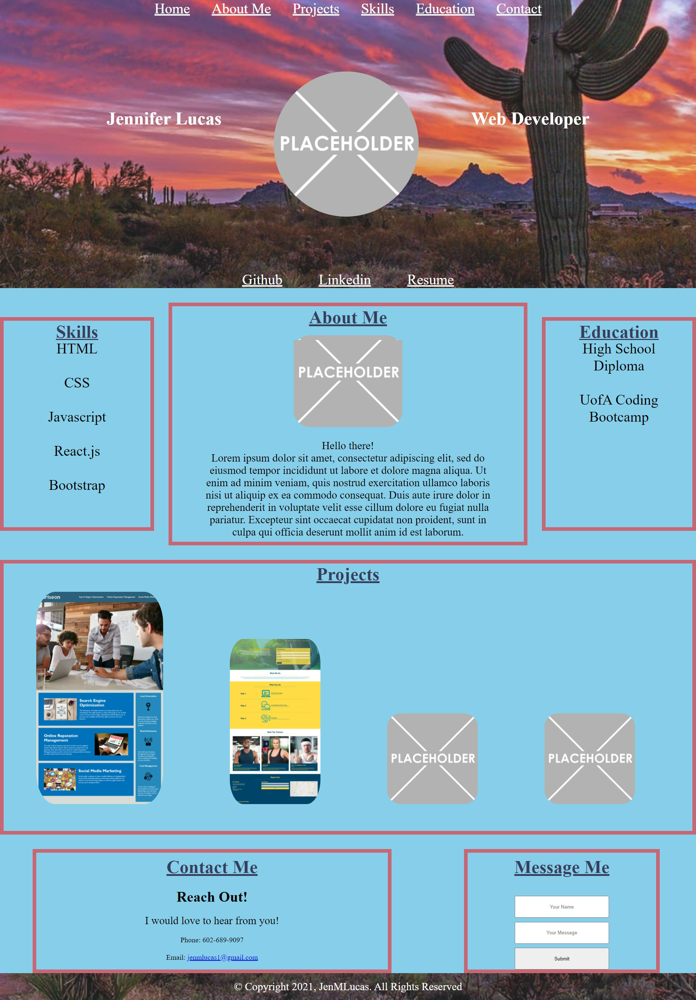

# Jennifer Lucas Portfolio

## Description- Portfolio
HTML
    • Created a webpage to display my abilities and projects as a full-stack web developer.
    • Formatted the webpage to be more acccessible, with semantic Html elements by adding the appropriate tags. 
    • Used Metatags and Sematic HTML for SEO optimizaton
    • To make all images have accessible alt attributes.
    • The heading attributes in sequential order.
    • The title element are concise, and descriptive. 

CSS
    • Added Class and Id elements to optimize organization and condense code.
    • Comments added for easy reading and comprehension.
    • Media queries added for flexible design on multiple screens. 

## Production Website
[Portfolio Website Link](https://jenmlucas.github.io/portfolio/ "Jennifer Lucas webpage")

## Usage 
This is how the website on your device will look.
    

## Credits 
To give thanks to all who have helped create this product.

[University of Arizona Bootcamp](https://courses.bootcampspot.com "UofA")

[Stack Overflow](https://stackoverflow.com/questions/7549561/section-vs-article-html5/ "StackOverflow")

[MDN Web DOCs](https://developer.mozilla.org/en-US/docs/Web/HTML/Element/aside "MDN")

## License 
©Copyright 2021, JenMLucas. All Rights Reserved